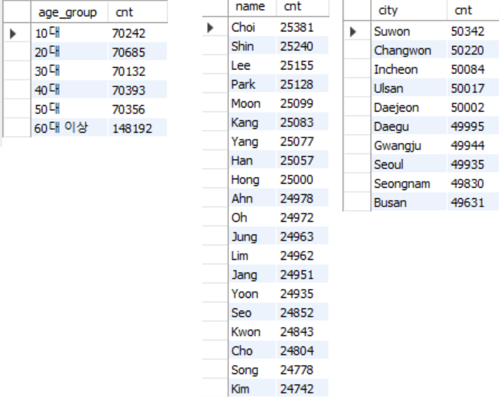
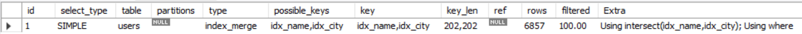
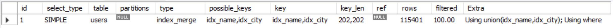

# MySQL Index Merge

## 1. 인덱스 머지란?

**Index Merge**는 MySQL 옵티마이저가 하나의 쿼리에서 **여러 개의 인덱스를 동시에 활용**하여 결과를 효율적으로 조회하는 최적화 기법입니다.

일반적으로 MySQL은 테이블당 하나의 인덱스만 사용하지만, 특정 조건에서는 여러 인덱스를 각각 탐색한 후 그 결과를 합치는 것이 더 효율적일 수 있습니다.

이때 옵티마이저는 Index Merge 기법을 선택하여 속도 개선을 시도합니다.

## 2. 인덱스 머지의 종류

인덱스 머지는 종류에 따라 3가지 알고리즘으로 나뉩니다.

**예시 데이터 분포**



### 2-1. Index_merge_intersection

교집합 알고리즘입니다.

WHERE 에 있는 조건절이 AND 조건이고, AND 조건절의 컬럼 2개가 모두 인덱스를 가지고 있을 경우 사용될 수 있습니다.

```sql
-- Table
CREATE TABLE users (
    id INT PRIMARY KEY,
    name VARCHAR(50),
    age INT,
    city VARCHAR(50),
    INDEX idx_name (name),
    INDEX idx_city (city)
);

-- Query
SELECT * FROM users 
WHERE name = 'Kim' 
  AND city = 'Seoul';
```

1. 인덱스 머지가 없다면?
    
    옵티마이저가 **하나의 인덱스**만 선택합니다.
    
    만약 idx_name 을 사용하는 경우
    
    1. name = ‘Kim’ 조건으로 스캔 → 결과 24742건
    2. 해당 결과를 조회하여 가져옴
    3. city = ‘Seoul’ 조건을 필터링 → 24742 건 중 2482건 조회
    
    만약 idx_city 를 사용하는 경우
    
    1. city='Seoul' 조건으로 idx_city 스캔 → 결과 49935건
    2. 해당 결과를 조회하여 가져옴
    3. name='Kim' 조건을 필터링 → 44935건 중 2482건 조회
2. 인덱스 머지가 수행되는 경우
    
    ```sql
    EXPLAIN SELECT * FROM users 
    WHERE name = 'Kim' AND city = 'Seoul';
    ```
    
    옵티마이저가 **두 개의 인덱스**를 모두 활용하여 교집합을 구합니다.
    
    
    
    type = index_merge
    
    key = idx_name, idx_city
    
    Extra = Using intersect 정보를 확인 가능.
    
    1. idx_name 스캔 → 24742건의 PK
    2. idx_city 스캔 → 49935건의 PK
    3. 교집합 계산 → 2482개의 PK를 얻는다 
    4. 해당 결과를 조회하여 가져옴, 즉 2482건만 조회. 

### 2-2. Index_merge_union

합집합 알고리즘입니다.

OR 조건절에서 각 인덱스의 결과를 합집합 처리하는 방식입니다.

OR 조건절에 있는 컬럼이 `=` 조건일 경우 사용됩니다.

```sql
-- Query
SELECT * FROM users 
WHERE name = 'Kim' 
  OR city = 'Seoul';
```

1. 인덱스 머지가 없다면?
    
    옵티마이저가 **하나의 인덱스**만 선택하거나 **풀 테이블 스캔**을 선택합니다.
    
    만약 idx_name 을 사용하는 경우
    
    1. name = ‘Kim’ 조건으로 스캔 → 결과 24742건
    2. 해당 결과를 조회하여 가져옴
    3. city = ‘Seoul’ 조건은 풀 테이블 스캔으로 추가적으로 확인
    
    풀 테이블 스캔을 사용하는 경우
    
    1. 인덱스 없이 테이블 전체를 읽으며 조건 체크
    2. 테이블이 크면 느려짐
2. 인덱스 머지가 수행되는 경우
    
    옵티마이저가 **두 개의 인덱스**를 모두 활용하여 합집합을 구합니다.
    
    
    
    rows 가 24742 + 49935보다 큰 이유는 옵티마이저가 계산한 이 값은 단순 예측값이기 때문입니다.
    
    1. idx_name 스캔 → 24742건의 PK
    2. idx_city 스캔 → 49935건의 PK
    3. 합집합 계산 → 72195개의 PK를 얻는다 
    4. 해당 결과를 조회하여 가져옴, 즉 72195건 조회.
    
    근데 분명 name = Kim 인 결과 정보와 , city = Seoul 인 결과 정보를 바로 합치면, name = Kim AND city = Seoul 인 컬럼의 개수만큼 중복 컬럼이 발생할 것입니다.
    
    MySQL은 이 조건 검색 결과가 **PK로 정렬**되어있음을 알고있습니다.
    
    왜냐면 모든 세컨더리 인덱스는 내부적으로 숨겨진 PK를 가진 복합 인덱스처럼 구성되기 때문입니다.
    
    그래서 세컨더리 인덱스는 구조적으로 세컨더리 인덱스 컬럼 + PK 컬럼처럼 동작합니다.
    
    그래서 name 조건과 city 조건으로 얻은 집합을 하나씩 가져와서 서로 비교하면서, PK 칼럼값이 중복된 레코드들을 정렬 없이 합치면서 걸러낼 수 있습니다.
    

### 2-1. Index_merge_sort_union

정렬 후 합집합 알고리즘입니다.

OR 조건에서 **범위 조건** 이 포함된 경우 사용됩니다.

왜냐하면 인덱스에서 범위 조건을 통해 얻은 결과들은 PK값이 자동으로 정렬되어있지 않기 때문에, 단순 Union 연산으로 합칠 수 없기 때문입니다.

```sql
EXPLAIN SELECT COUNT(*) FROM users 
WHERE name = 'Kim' OR age < 11 ; 
```

1. 인덱스 머지가 없다면?
    
    옵티마이저가 **하나의 인덱스**만 선택하거나 **풀 테이블 스캔**을 선택합니다.
    
2. 인덱스 머지가 수행되는 경우
    
    idx_name 은 위와 동일하게 스캔한다.
    
    idx_age를 스캔하게 될 경우
    
    age = 8 의 리프는 PK : [100,200,300]을,
    
    age = 9 의 리프는 PK : [10,20,30] 을,
    
    age = 10 의 리프는 PK : [150,500] 을
    
    …
    
    이를 합치면? PK : [100,200,300,10,20,30,150,500] 와 같이
    
    정렬되지 않은 PK 들을 얻게되어버립니다.
    
    PK가 정렬되어있지 않다면?? 중복 제거하는 Union 연산을 수행하는데 어려움이 생깁니다.
    
    그래서 이 PK들을 정렬한 뒤, 합치는 연산을 수행하게됩니다.
    
    근데 왜 쿼리에서 age<11 로 애매하게 해놨나요??
    
    age < 12 로 하니 Extra에서 옵티마이저는 Where 절을 사용할 것이라고 말했습니다.
    
    재밌는게…
    
    - age < 11 까진 sort union 사용
    - age < 12 부턴 where절 사용
    
    왜 그럴까요?
    
    age < 11 의 개수는 7143 개
    
    age < 12 의 개수는 14185 개
    
    근데 name = ‘Kim’ 의 개수는? → 24742개.
    
    그야 옵티마이저가 예측해보았더니 kim 예상이 24000개인데 거기서 14185개를 뽑는건 충분히 뽑아온 전체 데이터가 의미있다고 판단해서 그런게 아닐까? 라고 생각했습니다.
    
    근데 50% 이하면 버리는 데이터가 더 많으니까 머지에서 드는 메모리 및 시간 비용이 더 합리적이라고 예측했기 때문에 위와 같이 옵티마이저가 동작했다고 볼 수 있을 것 같습니다.
    
    ```sql
    EXPLAIN SELECT COUNT(*) FROM users 
    WHERE name = 'Kim' OR id > 20000; 
    ```
    
    그렇다면 위 코드는 어떤 인덱스 머지 알고리즘을 사용할까???
    

## 3. 인덱스 머지의 의의

앞서 2-3에서 보셨든 인덱스 머지는 무조건적으로 합리적인 방법이 아닐 수 있습니다.

인덱스와 실제 조회할 결과값에 따라서 그 결과가 결정됩니다.

즉 인덱스 머지는

> **‘단일 인덱스로는 최적화가 좀 부족하니까 여러 인덱스가 있다면 각각 타서 그 결과를 합쳐보자’**
> 

라고 판단했을 때 선택하는 실행 계획입니다.

사실 인덱스 머지는 ‘**느립니다**’

복합 인덱스를 사용하는 것에 비해 대부분의 상황에서 단점이 부각된다고 합니다.

왜냐면…

- 복합 인덱스는 1개의 인덱스로 조회합니다. 그러나 인덱스 머지는 결국 인덱스 2개를 스캔합니다.
- 임시 집합, 즉 인덱스 스캔의 결과 PK들을 메모리에 저장해야 합니다. 또 교집합과 합집합을 계산해야 합니다. 여기서 CPU + 메모리 비용이 발생합니다.
- 복합 인덱스는 커버링 인덱스의 효과를 볼 수 있지만, 인덱스 머지는 PK목록만 얻어내고 연산한 결과를 테이블에서 결국 조회해야 하기 때문에 효과를 볼 수 없습니다.

그 외에도 LIMIT 과의 궁합이 나쁘고, 데이터 분포 변화에 취약해 실행 계획의 안정성이 낮다는 단점을 가집니다.

그렇다면 Index Merge는 뭐때문에??…

Index Merge가 자주 보인다면 현재 **쿼리 상에서 인덱스가 부족**해 발생하는 신호로 받아들이는 것이 옳다고 합니다.

만약 자주 실행하는 쿼리문에서 Index Merge가 발생한다면, 복합 인덱스를 부여해서 위와 같은 상황을 개선하거나, OR 조건절을 UNION OR 조건절로 분기하여 사용자가 쿼리 수준에서 각각 최적의 인덱스를 부여하고 중복제거를 수행해주는 방향으로 작성하는 것이 더 나은 방법이 될 수 있습니다.
