# SSAFY-CS-STUDY-15th 2026-01-27 김동연 

# 우리의 SQL은 어디로 가는가

딥다이브라는 막연한 부담감을 안고, 주제 선정에서 방황한 결과, 원초적으로 가는것이 가장 쉽겠다 라고 판단했습니다.

예전부터 이론 학습을 통해 배울때 자료구조 같은 것들을 배우다보면, 항상 느낀것이

아, 시각적으로 보이면 이해가 더 잘될텐데 했습니다.

그래서 농담 반 진담 반으로 20살때 C언어로 링크드리스트를 배우고 구현하면서 어려움을 많이 느꼈는데

‘눈을 감고 내가 직접 노드가 되어서 이 연결리스트의 파도 속에서 노드들과 함께 순회하는걸 상상해라.’ 라고 말하고 다녔던게 생각납니다.

그런 이유로 직관적으로 DB하면 떠오르는것, SQL문이 어떻게 Client에서 DB까지 가는지, 어떤 파이프라인을 가지고 있는지에 대해 한번 딥다이브 해보려고 합니다.

## 1. 개요

설명에 앞서서 실제로 테스트에 사용해본 테이블에 대한 구조만 아주 간단하게 설명드리겠습니다.

provinces - 시(서울특별시, 인천광역시, 부산광역시, 등…)

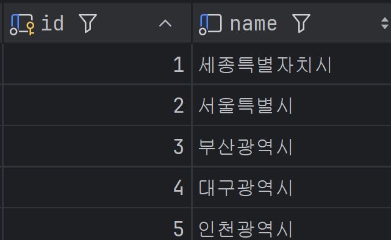

districts - 시군구(종로구, 중구, 용산구 ,,,)

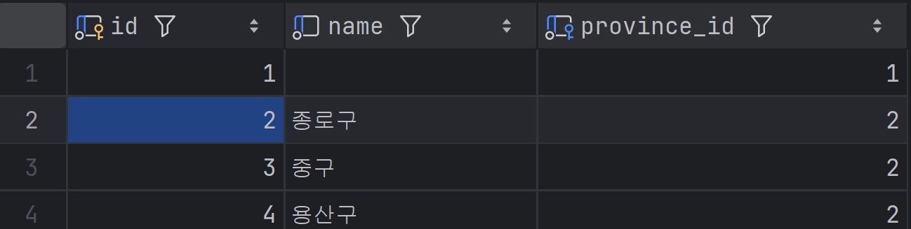

Addresses - 도로명주소

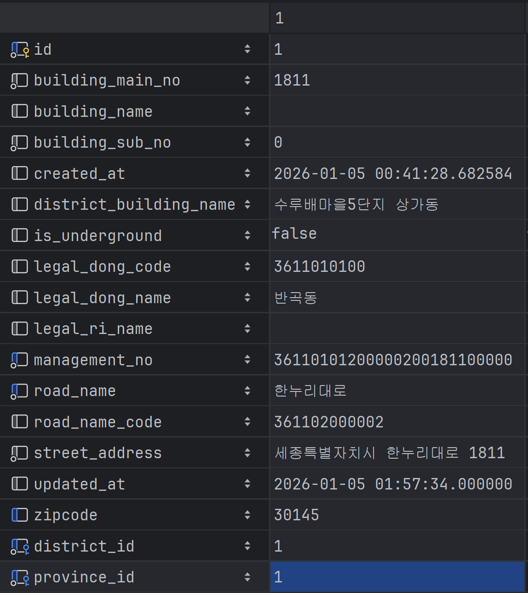

<aside>

MySQL 버전 8.0.43 사용

</aside>

## 2. MySQL 파이프라인

가장 추상화된 단계부터, 최대한 딥다이브라는 주제에 맞게,,,

내부 아키텍쳐에 대해 설명할 수있는 만큼, 시각적으로 보여줄 수 있는 만큼 보여드리고자 합니다.

### 2.1 1단계

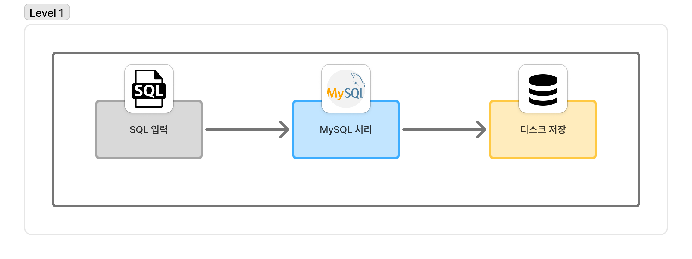

1. SQL문 입력
2. MySQL이 SQL 처리
3. 디스크에 데이터 저장

### 2.2 2단계

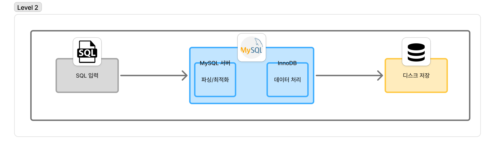

1. SQL 입력
2. MySQL 처리
    
    <aside>
    
    MySQL 서버 (파싱/최적화) → InnoDB 엔진 (데이터 처리)
    
    </aside>
    
3. 디스크 저장

**MySQL 서버**

전체 데이터베이스 시스템 → 클라이언트 연결 관리 / SQL 파싱(문법 검사) / 쿼리 최적화(실행 계획 수립)

**InnoDB**

실제 데이터를 처리하는 MySQL의 스토리지 엔진

메모리와 디스크 모두에서 데이터가 저장되는 방식을 관리하는 데이터베이스의 구성 요소

MySQL 서버가 실제로 어떻게 쿼리를 파싱하고 최적화 하는지 보고 넘어가겠습니다.

READ

인덱스를 넣은 쿼리

```sql

EXPLAIN SELECT * FROM addresses WHERE id = 1;
```

EXPLAIN 을 보면, MySQL 서버가 쿼리를 최적화하는것을 볼 수 있음.

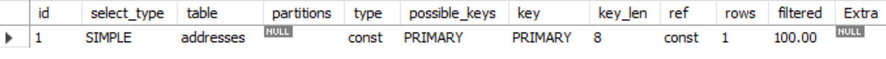

복합 인덱스를 넣은 쿼리

시 → 시군구 순으로 복합 인덱스 설정했을 때

```sql
EXPLAIN SELECT * FROM addresses WHERE province_id = 2 AND district_id = 4;
```

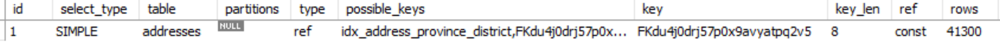

인덱스 없는 쿼리

```sql
EXPLAIN SELECT * FROM addresses WHERE management_no = 4;
```

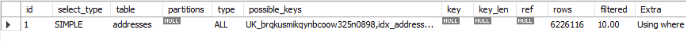

별개로 인덱스가 효율이 좋지 않은 컬럼(ex : gender (MALE, FEMALE) 2개 인 경우)을 WHERE 절에서 조건으로 걸었을 때는

Optimizer가 Index 조회가 손해라고 생각이 들면? 오히려 Full Table Scan을 하는 경우도 발생합니다.

이렇듯 MySQL 서버에서 파싱/최적화를 담당한 후 이에 대한 실행 계획을 InnoDB에 보내서, InnoDB 가 데이터를 어떻게 저장하고 불러올지를 결정하고 실행합니다.

### 2.3 3단계

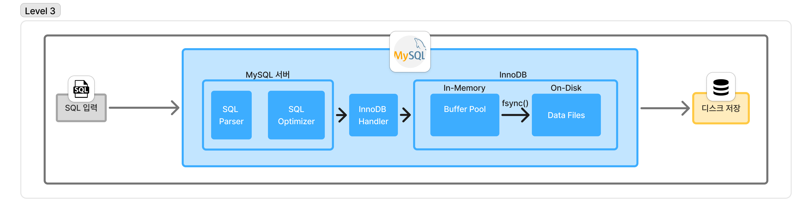

1. SQL 입력
2. MySQL 처리
    
    <aside>
    
    1. MySQL 서버
        - SQL Parser
        - SQL Optimizer
    2. InnoDB Handler
    3. InnoDB
    
    <aside>
    
    1. In-Memory
        - Buffer Pool
    2. On-Disk
        - Data Files
    </aside>
    
    </aside>
    
3. 디스크 저장

**InnoDB Handler**

최적화를 끝낸 쿼리문을 InnoDB에게 전달하는 처리자.

실제로 데이터를 어떻게 가져올지 InnoDB에게 세부 명령을 내림.

```sql
-- Handler Session Flush로 초기화 이후 진행
SELECT * FROM addresses WHERE id = 1;

SHOW SESSION STATUS LIKE 'Handler%';
```

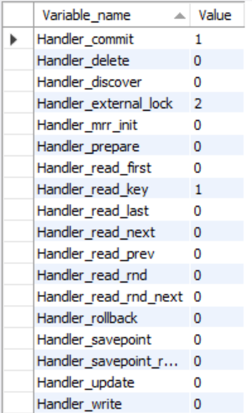

```sql
-- Handler Session Flush로 초기화 이후 진행
SELECT * FROM addresses 
WHERE district_id = 4 
LIMIT 100;

SHOW SESSION STATUS LIKE 'Handler%';
```

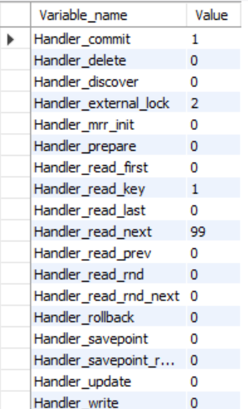

Select 지만 내부적으로 autocommit이라는 변수가 1일경우 select도 트랜잭션으로 처리해서 커밋이 1 증가했습니다.

Handelr_external_lock -MySQL 서버가 Storage Engine을 제어하기 위해서 접근한다 라는걸 알리는 정도의 장치로 실제 Lock은 아니라고 합니다.

district_id = 4 조건으로 인덱스 1회 조회.(인덱스 스캔 시작점인 레코드 위치를 찾음)

나머지 99개는 인덱스를 따라 순서대로 조회했음을 의미

**Buffer Pool**

InnoDB 내부에 존재하는 공간입니다.

이름부터 매우 직관적

InnoDB는 요청한 데이터를 Disk에서 바로 가져오지 않음.

메모리에 캐싱되어있는 데이터를 가져옴.

즉 MySQL내장 인메모리 캐시 역할.

InnoDB가 데이터를 Page(16KB) 단위로 관리하기 떄문에 페이지를 캐싱하는 공간이라고 보시면 되겠습니다.

만약 페이지가 버퍼 풀에 꽉 찼다면 기본적으로 LRU(Least) + MRU(Most) 알고리즘을 결합한 하이브리드 방식으로 교체한다.

**READ**

```sql
SHOW VARIABLES LIKE 'innodb_buffer_pool_size';
```

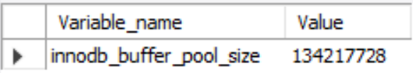

= 128MB

캐시 히트율?

```sql
SHOW STATUS LIKE 'Innodb_buffer_pool%';
```


(1-806/28616) * 100 = 약 97%…

버퍼풀 페이지 현황

```sql
SHOW STATUS LIKE 'Innodb_buffer_pool_pages_%';
```

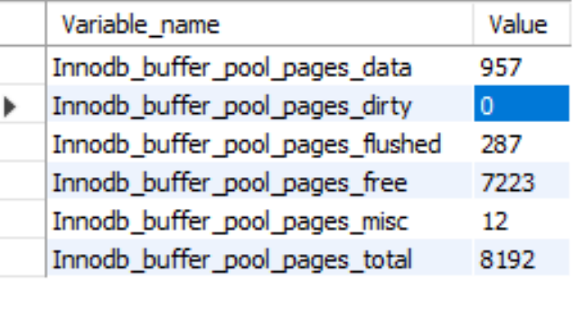

total page 개수 = 8192

16KB * 8192 = 128MB

`pages_dirty`= 버퍼에서 수정되었지만 write 반영되지 않은 페이지

`pages_flushed` = dirty → Disk로 write 된 페이지 개수

`pages_misc` = 기타 내부 구조용

디스크에 WRITE되는 시점 = BackGround Thread 비동기 처리

실제 디스크 작성시 `fsync()` 시스템 콜 사용

**WRITE**

실제 DB에 write를 진행하면 Dirty Page(메모리에는 쓰여졌지만 DB에는 쓰여지지 않은 페이지)가 증가함을 볼 수 있다.

```sql
FLUSH STATUS;

-- 더티 페이지 수 확인 (Before)
SELECT VARIABLE_VALUE AS 'Dirty Pages Before'
FROM performance_schema.global_status 
WHERE VARIABLE_NAME = 'Innodb_buffer_pool_pages_dirty';

START TRANSACTION;
INSERT INTO districts (name, province_id) VALUES ('버퍼풀 더티페이지 테스트', 2);
INSERT INTO districts (name, province_id) VALUES ('버퍼풀 더티페이지 테스트', 2);
INSERT INTO districts (name, province_id) VALUES ('버퍼풀 더티페이지 테스트', 2);
COMMIT;

-- 더티 페이지 수 확인 (After)
SELECT VARIABLE_VALUE AS 'Dirty Pages After'
FROM performance_schema.global_status 
WHERE VARIABLE_NAME = 'Innodb_buffer_pool_pages_dirty';
```

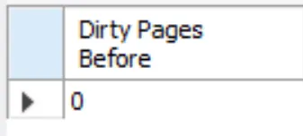

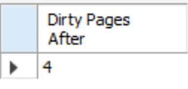

```sql
SELECT 
  VARIABLE_NAME,
  VARIABLE_VALUE
FROM performance_schema.global_status
WHERE VARIABLE_NAME LIKE '%buffer_pool_write%';

START TRANSACTION;
INSERT INTO districts (name, province_id) VALUES ('버퍼풀 쓰기 테스트', 2);
INSERT INTO districts (name, province_id) VALUES ('버퍼풀 쓰기 테스트', 2);
INSERT INTO districts (name, province_id) VALUES ('버퍼풀 쓰기 테스트', 2);
INSERT INTO districts (name, province_id) VALUES ('버퍼풀 쓰기 테스트', 2);
INSERT INTO districts (name, province_id) VALUES ('버퍼풀 쓰기 테스트', 2);
INSERT INTO districts (name, province_id) VALUES ('버퍼풀 쓰기 테스트', 2);
COMMIT;

SELECT 
  VARIABLE_NAME,
  VARIABLE_VALUE
FROM performance_schema.global_status
WHERE VARIABLE_NAME LIKE '%buffer_pool_write%';
```

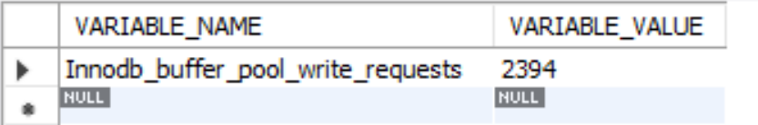

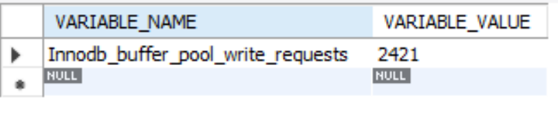

마찬가지로 쓰기 작업시 buffer_pool에 write 요청도 증가함을 알 수 있다


### 2.4 4단계

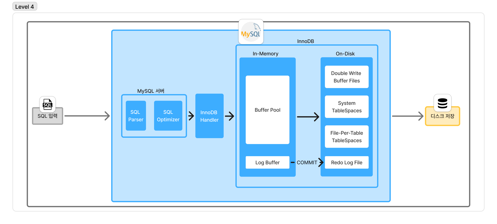

1. SQL 입력
2. MySQL 처리
    
    <aside>
    
    1. MySQL 서버
        - SQL Parser
        - SQL Optimizer
    2. InnoDB Handler
    3. InnoDB
    
    <aside>
    
    1. In-Memory
        - Buffer Pool
        - Redo Log Buffer
    2. On-Disk
        - Redo Log File
        
        ---
        
        - Double Write Buffer Files
        - System TableSpace
        - File-Per-Table TableSpace
    </aside>
    
    </aside>
    
3. 디스크 저장

**TableSpace**

데이터를 저장하는 물리적 공간.

논리적 저장공간 = Table

물리적 저장공간 = File

그 테이블이 물리적으로 저장된 파일들의 집합 = TableSpace

지금은, 2가지 종류

1. System Tablespace
    
    ibdata1 공용 창고
    
2. File-Per-Table TableSpace
    
    테이블명.ibd - 개인 창고
    

**Redo Log Buffer & Redo Log File**

Redo Log Buffer (In-Memory)

Redo Log(On-Disk)

1. 데이터 수정시 Redo Log 에 먼저 기록
2. COMMIT → Redo Log를 디스크에 fsync()
3. 실제 데이터 파일은 나중에 천천히 쓰기.
4. 장애 발생시 Redo Log로 복구.

실제로는 

Redo Log → Double Write Buffer → Disk Write

순서로 데이터가 저장된다.

그래서 Disk Write 도중 DB 장애 발생시 Double Write Buffer에서,

Double Write Buffer 쓰기 도중 장애 발생시 Redo Log에서,

Redo Log 쓰기 도중 발생시 COMMIT 이 이루어지지 않았으므로 ROLLBACK을 통해 데이터 안정성을 보장합니다.

```sql
SHOW VARIABLES LIKE 'innodb_redo_log%';
```

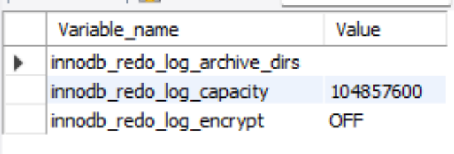

MySQL 8.0.30 부터

#innodb_redo 폴더에 3200KB 파일 32개 → 102400KB → 약 100MB로 관리

이 파일들이 순환하며 재사용됩니다.

이전에는 고정 파일 2-3개를 사용했고 크기 변경 동적으로 불가능했는데,

현재는 동적으로 개수 조절이 가능한 3.2MB 파일들을 사용합니다.

*Undo?

MVCC(격리 수준) 구현에 사용, 트랜잭션 롤백용


**Write**

```sql
SELECT 
  VARIABLE_NAME,
  VARIABLE_VALUE
FROM performance_schema.global_status 
WHERE VARIABLE_NAME LIKE '%lsn'
   OR VARIABLE_NAME LIKE 'Innodb_log_write%';

START TRANSACTION;
INSERT INTO districts (name, province_id) VALUES ('리두로그 쓰기테스트', 2);
INSERT INTO districts (name, province_id) VALUES ('리두로그 쓰기테스트', 2);
INSERT INTO districts (name, province_id) VALUES ('리두로그 쓰기테스트', 2);
INSERT INTO districts (name, province_id) VALUES ('리두로그 쓰기테스트', 2);
INSERT INTO districts (name, province_id) VALUES ('리두로그 쓰기테스트', 2);
INSERT INTO districts (name, province_id) VALUES ('리두로그 쓰기테스트', 2);
COMMIT;

SELECT 
  VARIABLE_NAME,
  VARIABLE_VALUE
FROM performance_schema.global_status 
WHERE VARIABLE_NAME LIKE '%lsn'
   OR VARIABLE_NAME LIKE 'Innodb_log_write%';
```

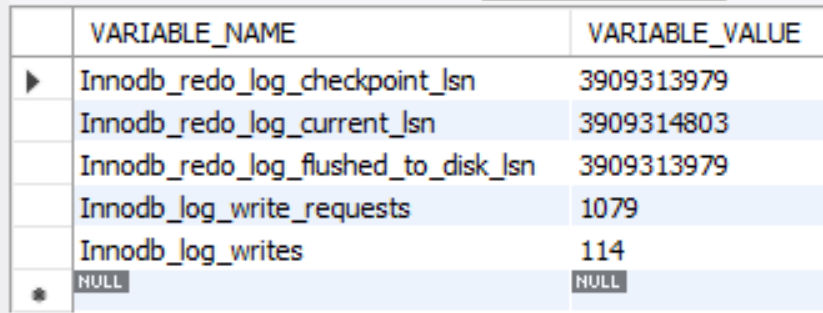

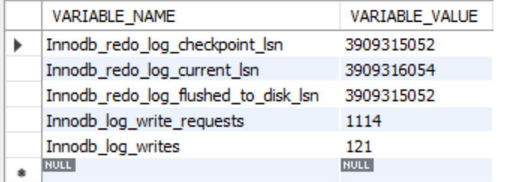

lsn(Log Sequence Number 증가), log 에 writes / write_requests 증가.

즉 Redo Log 에 실제로 데이터가 저장되고있음을 알 수 있음.

**Double Write Buffer Files**

이중 쓰기 버퍼

MySQL은 페이지 단위로 디스크에 쓴다.

쓰기 전에, 버퍼에 먼저 기록한다.

쓰기 작업 중 문제가 생겼을때 이를 통해 복구한다.

```sql
SHOW VARIABLES LIKE 'datadir';
```

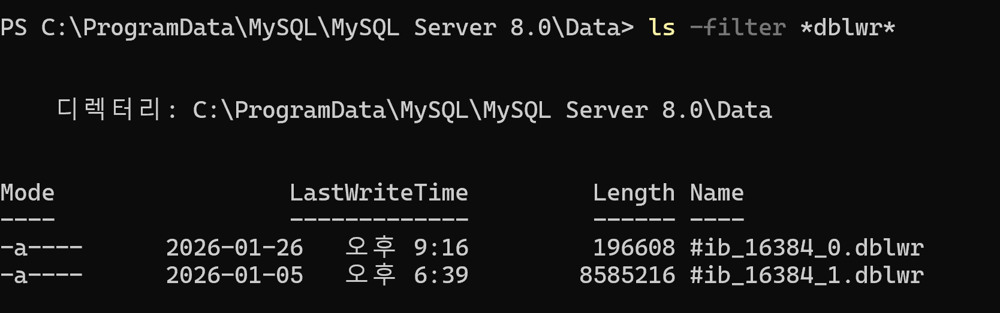

**System TableSpace**

1. Data Dictionary - 용어사전 - 메타데이터 저장소
2. Change Buffer - 보조 인덱스 변경시 임시 저장장소
3. Undo Logs - 트랜잭션 롤백용

공용 저장소 역할

`ibdata1` 이라는 이름으로 저장되어있다.

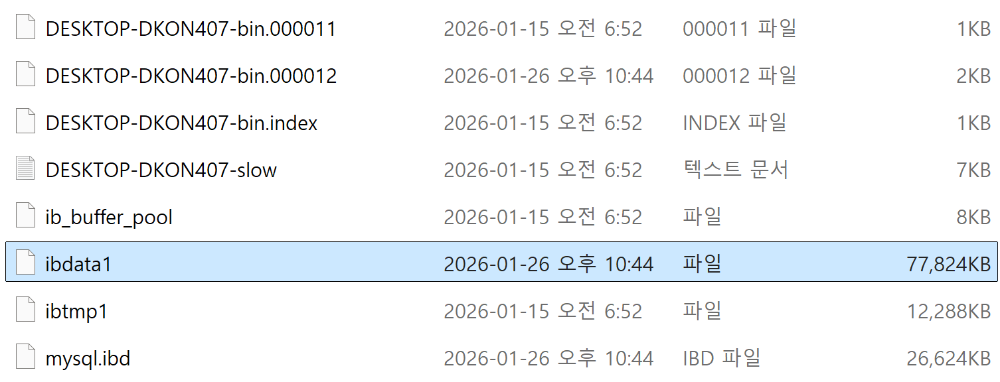

**File-Per-Table Tablespace**

실제 논리적인 각 테이블 하나마다 하나씩 가지는 별도의 파일입니다.

`테이블명.ibd`

테이블 관리를 용이하게 하기 위해 테이블1개당 1개 파일로 저장.

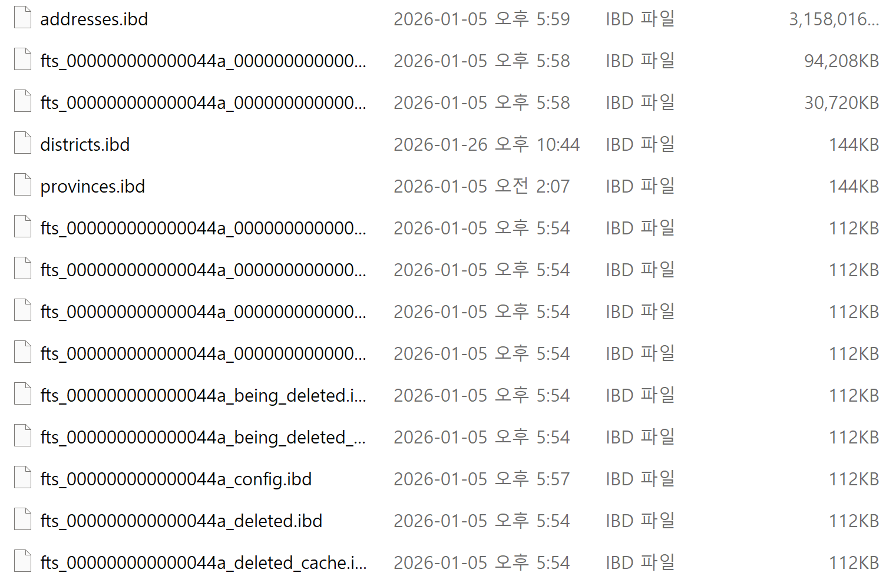

## 3. 마치며

### 3.1 소감

이전에는 기술 하나에 대해 깊이 크게 파고든 적이 별로 없었습니다. 특히 CS지식같은 경우는 학부에서 배운 내용 수준으로만 머리속에 구겨 넣었습니다.

이번 스터디를 준비하며 InnoDB 아키텍처를 파고들었지만, 솔직히 "딥다이브"라고 부르기엔 겉핥기에 불과했습니다.

그러나 오히려 공부하면서 **데이터베이스라는 분야의 깊이**를 새삼 깨달았습니다.

**백엔드 개발자와 데이터베이스**

처음에는 백엔드 개발자의 DB 역량이라고 하면:

- SQL 쿼리를 작성할 줄 안다
- 적절한 인덱스를 설정해서 병목을 개선한다

이 정도면 충분하다고 생각했습니다.

하지만 현실은,,,

DBA와 백엔드 개발자가 명확히 분리된 기업이 많지 않고, 결국 DB 운영까지 개발자의 몫인 경우가 대부분입니다.

그렇기에 DB 활용 역량이 백엔드 개발자에게 요구되는 건 어쩌면 당연한 일입니다.

**깨달음**

그런데 역설적이게도, 역할이 확장될수록 각 분야를 깊게 파기는 더 어려워집니다.

이번에 MySQL을 제대로 공부해보려 시도하면서 느낀 건, 데이터베이스는 정말 방대한 분야라는 것입니다:

- InnoDB 아키텍처만 해도 수십 개의 구성요소
- 각 구성요소마다 최적화 포인트
- 버전마다 달라지는 내부 구현
- 장애 대응, 복제, 백업, 복구... 등등…

"**찍먹**"이지만 진지하게 파보니, 이 분야만 전문으로 하는 DBA가 왜 존재하는지 이해가 됐습니다.

결론

완벽한 딥다이브는 아니었지만, "**내가 모르는 게 얼마나 많은지**"를 아는 것만으로도 의미 있는 시간이었습니다.

### 3.2 5단계 추가 학습

사실 아키텍쳐 더 파면 정말 많이 나옵니다. 근데 도저히 한번에 다룰 양이 아닌것같습니다.

주제 선정 미스라고 생각합니다 죄송합니다…

추가적으로 아래와 같은 용어들이 있으니 아키텍처를 공부하면서 궁금함이 생긴 영역은 추가적으로 찾아보는 방식으로 공부하는게 효율적이라고는 생각이 듭니다.

- InnoDB Locking (Row Lock, Gap Lock, Next-Key Lock)
- MVCC (Multi-Version Concurrency Control)
- Adaptive Hash Index
- Change Buffer 최적화
- Checkpoint 메커니즘
- Crash Recovery 과정
- InnoDB Purge Thread
- Buffer Pool Paging Algorithm