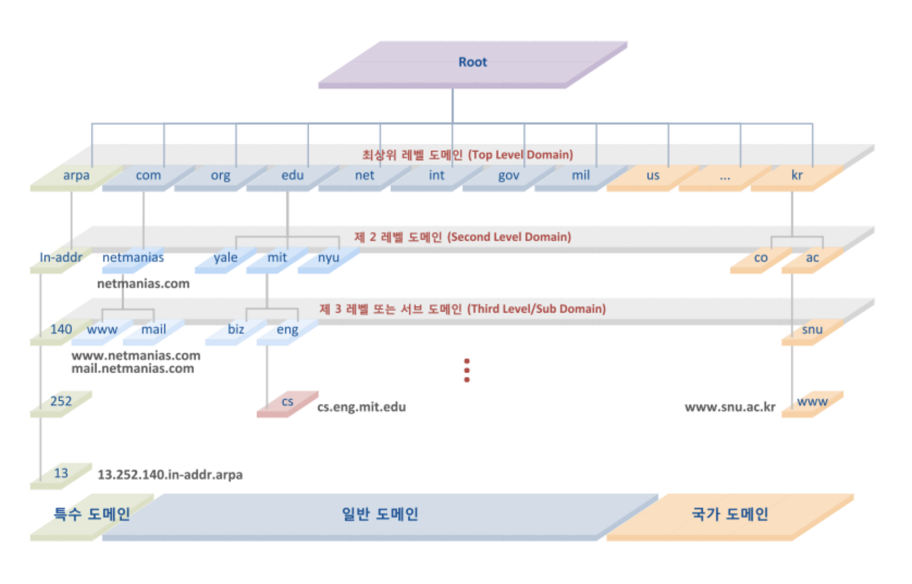
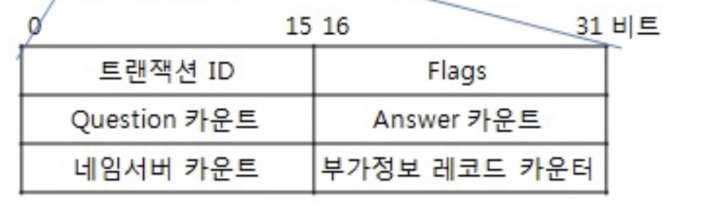
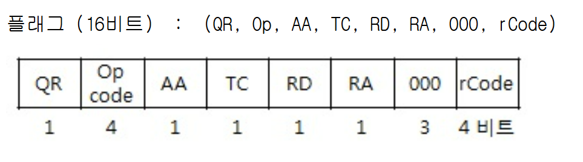
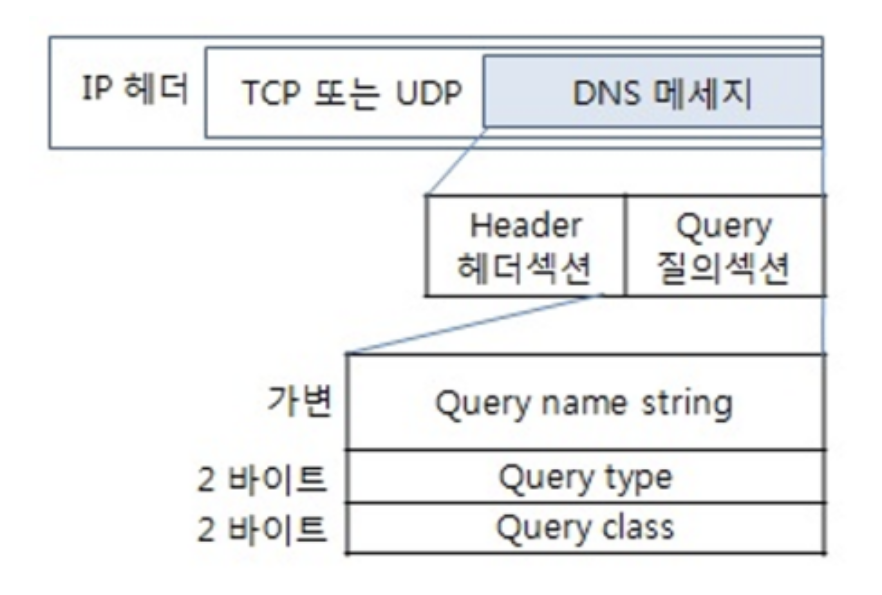
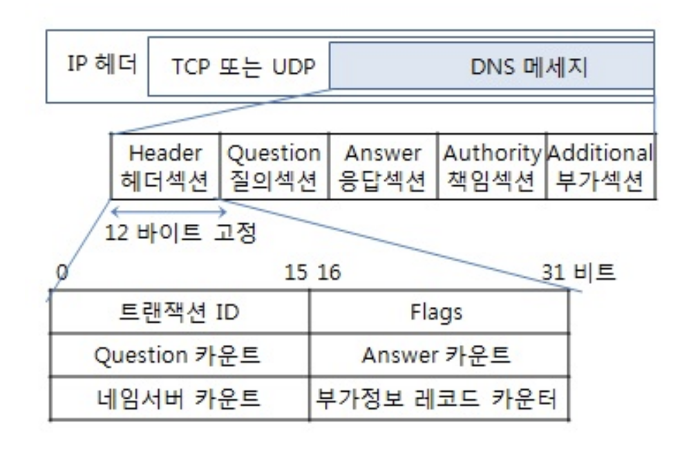
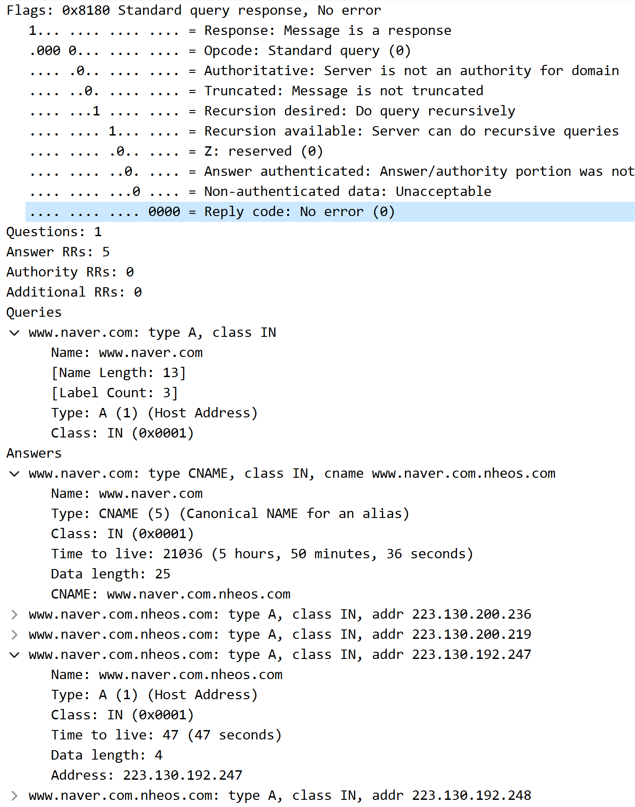
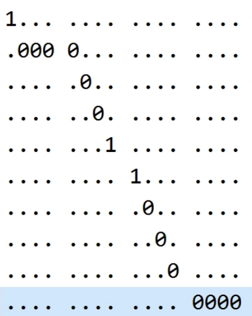

# DNS

## 1. DNS와 동작 과정

> **Domain Name System**

사람이 읽을 수 있는 도메인 이름을 기계가 읽을 수 있는 IP 주소로 변환하는 것.

기본적으로, 다음과 같이 동작한다.

1. 도메인 주소(naver.com) 을 브라우저에 입력한다
   1. 브라우저, OS 캐시를 확인한다.
2. Stub Resolver를 통해 Recursive Resolver에 재귀 질의한다.
   1. Root DNS 확인( . )
   2. TLD DNS 확인( .com)
   3. Authoritative DNS 확인 ( [naver.com](http://naver.com) 최종 주소 )
3. 최종 IP 정보를 확인하고 Stub Resolver 에 전달한다
4. 전달받은 IP 주소로 접속한다.

즉, 사람이 복잡한 IP주소를 외울 필요 없이, 도메인 이름으로 IP주소를 얻는 과정이다.

이러한 과정은 Root → TLD → Authoritative 계층 구조에 분산되어, 여러 서버를 거쳐가야 한다.



ㄴ 아주 간단히 DNS 서버를 정리한 사진

아무튼, 이러한 과정을 수행하는것은 **Recursive Resolver**의 **재귀 질의(Recursive Query)**가 수행한다.

## 2. 재귀 질의와 반복 질의의 동작 과정

**Recursive Resolver란?**

> Recursive Resolver란 최종 IP를 찾을 때까지, 다른 **DNS 서버들을 순차적으로 탐색하며 대신 질의해주는 DNS 서버**입니다.

즉, 이 영역에서 직접 [naver.com](http://naver.com) 에 대한 IP주소를 모두 찾아서 다시 전달해주는것입니다.

**재귀 질의(Recursive Query)와 반복 질의(Iterative Query)란?**

- **재귀 질의**
  Stub Resolver가 Recursive Resolver에게 던지며, 네가 계속 돌면서 `naver.com` 에 해당하는 IP의 최종 정답 반환을 원하는 쿼리.
- **반복 질의**
  Recursive Resolver가 각 권한 서버에, `naver.com` 에 해당하는 IP가 있니?
  물어보고 모르면 다음에 어디 물어볼지를 원하는 쿼리.

그렇다면 실제로 이 재귀 질의는 어떤 패킷을 통해 이루어질까? "재귀로 찾아줘"라는 의미는 패킷 안에서 어떻게 표현되며, 응답 패킷에서 최종 답과 위임 응답은 어떻게 구분될까?

## 3. 재귀 질의를 위한 DNS 패킷 구조

DNS 주소 탐색 요청 또한, 패킷으로 이루어집니다.

크게, DNS 질의 패킷과 DNS 응답 패킷으로 나뉩니다.

두 패킷은 모두 메시지 내부에 12바이트 고정 길이 헤더를 가집니다.



- 트랜잭션 ID = DNS 클라이언트와 서버가 사용하는 식별자
- 플래그 = 패킷의 성격을 결정하는 비트 플래그들입니다.
  
  1. **QR(1 비트)**

     Query / Response = 메시지가 질의인지 응답인지

  2. OP code(4 비트)

     표준 질의/응답인지, 역 질의인지, 서버의 상태 요구인지, 통신인지, 갱신인지

  3. **AA(1비트)**

     해당 도메인의 Authoritative 서버가 직접 답할 경우 1입니다.

  4. TC

     메시지가 512 바이트 넘어 잘리면 1입니다.

  5. **RD(1비트)**

     = Recursion Desired = 요청자의 재귀 질의 요청

     0이라면 반복 질의를 요청합니다.

     1이라면 재귀 질의를 요청합니다.

  6. **RA(1비트)**

     = Recursion Available = 응답자의 재귀 질의 지원여부 응답

     1이라면 재귀 질의를 지원하는 서버입니다.

  7. 000 = Z , AD , CD(3비트)

     예약된 영역으로, 항상 000 입니다.

  8. rCode

     응답 코드입니다.

- 질의 카운트 = 질문의 수
- 응답 카운트 = 응답의 수
- 네임서버 카운트 = 권한 레코드의 수
- 추가정보 카운트 = 추가 레코드의 수

1. **DNS 질의 패킷**

   질의 패킷의 경우는, 앞선 헤더의 플래그가 다음과 같이 설정될 것입니다.

   ```
   QR = 0(질의)
   OPCODE = 0(표준)
   AA = 0
   TC = 0
   **RD = 1(재귀 검색 요청)**
   RA = 0
   RCODE = 0
   ```

   

   Query Name String에는 도메인 이름이 들어갑니다. 이때 문자열 그대로 들어가지 않고, 라벨 길이 + 라벨 형식으로 인코딩됩니다.

   ```
   naver.com ( 5 + 3 )
   -> \x05 naver \x03 com \x00
   -> 05 6E 61 76 65 72 03 63 6F 6D 00
   ```

   Query Type은 질의할 레코드 종류입니다. 이 도메인에서 원하는 정보가 무엇인가를 지정합니다.
   - A = IPv4 주소 = 원하는 IP주소
   - NS = 네임서버 주소, CNAME = 별칭 등,,,,

   Class는 질의가 속하는 네트워크 체계로, 거의 항상 IN=Internet을 의미합니다. 거의 형식상 존재합니다.

2. **DNS 응답 패킷**

   응답 패킷은 거의 질의 패킷과 동일한 포맷이지만, 메시지에 추가적인 섹션이 있습니다.

   

   이때, 응답은 2가지 경우로 나뉩니다.

   답을 모르고, 다음 DNS에 위임하는 경우 = Root이나 TLD 서버의 응답인 경우
   1. Header Section

      플래그

      ```
      **QR = 1(응답)**
      OPCODE = 0(표준)
      AA = 0(1이라면 Auth의 공식 답, 여기서는 도메인 관리자가 아니니까 0)
      TC = 0
      **RD = 0(반복 질의였음)**
      **RA = 0(해당 서버는 재귀 지원 안함)**
      RCODE = 0
      ```

      Answer 카운트 = 0

      네임서버 카운트 > 0 = 위임한 네임서버의 레코드 수

      부가정보 카운트 > 0 = 네임서버의 IP 수

   2. Query Section

      질의 내용과 동일(naver.com / A / IN)

   3. Answer Section

      비어있음 = 답 모름

   4. Authority Section

      ```
      a.gtld-servers.net. nstld.verisign-grs.com. 1772451021 1800 900 604800 900
      ```

      .com 의 경우는 이 도메인이 관리중임을 의미.

   5. Additional Section

      그 도메인의 IP주소는 여기 적혀있음

   최종 답을 아는 경우 = 즉 Authoritative 서버의 IP주소 응답인 경우
   1. Header Section

      플래그

      ```
      **QR = 1(응답)**
      OPCODE = 0(표준)
      **AA = 1(권한 있는 응답)**
      TC = 0
      **RD = 0(반복 질의였음)**
      **RA = 0(해당 서버는 재귀 지원 안함)**
      RCODE = 0
      ```

      Answer 카운트 = 1 = 최종 답변 수!

      네임서버 , 부가정보 카운트 = 0

   2. Query Section

      질의 내용과 동일(naver.com / A / IN)

   3. Answer Section

      ```
      C0 0C             → NAME: 압축 포인터 → "naver.com"
      00 01             → TYPE: A (IPv4)
      00 01             → CLASS: IN
      00 00 01 2C       → TTL: 300초
      00 04             → RDLENGTH: 4바이트
      DF 82 C8 DB       → RDATA: 223.130.200.219
      ```

      여기서 C0 0C 는 이름 압축의 결과입니다.

      응답에서 도메인 이름이 반복 등장되는데, 전체를 매번 패킷에 쓰는 대신 포인터를 통해 이전의 위치를 확인하도록 합니다.

      ```
      C0 0C = 1100 0000 0000 1100
      첫 상위 2비트가 00 = 일반 라벨
      첫 상위 2비트가 11 = 포인터를 의미. 나머지 14비트는 오프셋
      즉, C = 12번째 바이트 다음으로 가서 읽어라.
      ```

   4. Authority Section

      비어있음 = IP주소 찾음

   5. Additional Section

      비어있음 = IP주소 찾음

## 4. Recursive Resolver 구현

아래 실험 코드는 시각화를 위해 클로드의 도움을 많이 받았습니다.

Stub Resolver의 요청을 받아 DNS 주소를 찾는 Recursive Resolver처럼 동작하도록 자바 코드를 작성했습니다.

Recursive Resolver의 역할을 좀더 잘 알아볼 수 있도록 합니다.

```java
DatagramSocket
UDP 통신용 소켓입니다. TCP의 Socket과 달리 연결 수립 없이 패킷을 바로 보내고 받습니다.
DNS가 UDP 기반이기 때문에 UDP 소켓을 사용합니다.

DatagramPacket
UDP로 주고받는 패킷 하나를 표현합니다.
보낼 때는 byte[] + 목적지 IP + 포트(53)를 담고
받을 때는 빈 byte[] 버퍼를 넘겨서 응답 데이터를 채워받습니다.

InetAddress
IP 주소를 Java 객체로 변환합니다.
문자열 "198.41.0.4"를 DatagramPacket에 넣을 수 있는 형태로 바꿔주는 역할입니다.
```

코드는 다음과 같은 로직을 따릅니다.

1. 질의 패킷 조립
2. UDP 전송 + 응답 수신
3. 헤더, Answer, Autority, Additional 파싱
4. 다음 서버로 이동

```java
// 1. 질의 패킷 조립 로직
byte[] query = buildQuery(domain);

// 2. UDP로 전송 + 응답 수신
// currentServer = ROOT_SERVER = "198.41.0.4"
// a.root-servers.net 의 주소라고 합니다
// UDP 소켓을 열고 53번 포트로 전송하고 응답을 받습니다.
byte[] response = sendQuery(currentServer, query);

// 3. Header 파싱
// 플래그 등 헤더 파싱
int flags = ((response[2] & 0xFF) << 8) | (response[3] & 0xFF);
int anCount = ((response[6] & 0xFF) << 8) | (response[7] & 0xFF);
int nsCount = ((response[8] & 0xFF) << 8) | (response[9] & 0xFF);
int arCount = ((response[10] & 0xFF) << 8) | (response[11] & 0xFF);
int qr     = (flags >> 15) & 0x1;
int opcode = (flags >> 11) & 0xF;
int aa     = (flags >> 10) & 0x1;
int tc     = (flags >> 9)  & 0x1;
int rd     = (flags >> 8)  & 0x1;
int ra     = (flags >> 7)  & 0x1;
int z      = (flags >> 4)  & 0x7;
int rcode  = flags & 0xF;

System.out.println("  [Header] FLAGS 0x" + String.format("%04X", flags)
        + " = " + String.format("%16s", Integer.toBinaryString(flags)).replace(' ', '0'));
System.out.println("    QR=" + qr + " (질의=" + (qr == 0 ? "O" : "X") + ", 응답=" + (qr == 1 ? "O" : "X") + ")"
        + "  OPCODE=" + opcode
        + "  AA=" + aa + " (권한 응답=" + (aa == 1 ? "O" : "X") + ")"
        + "  TC=" + tc
        + "  RD=" + rd + " (재귀 요청=" + (rd == 1 ? "O" : "X") + ")"
        + "  RA=" + ra
        + "  RCODE=" + rcode);
System.out.println("    ANCOUNT=" + anCount
        + "  NSCOUNT=" + nsCount
        + "  ARCOUNT=" + arCount);

// 4. Answer Section 파싱
if (anCount > 0) {
for (int i = 0; i < anCount; i++) {
int[] recordResult = parseRecord(response, offset);
        offset = recordResult[0];
        int type = recordResult[1];
        int rdLength = recordResult[2];
        int rdataOffset = recordResult[3];

        if (type == 1) { // A 레코드
            String ip = parseIP(response, rdataOffset);
            System.out.println("  [Answer] " + domain + " → " + ip + " (AA=" + (aa ? 1 : 0) + ")");
            return ip;
        } else if (type == 5) { // CNAME 레코드
            String cname = readName(response, new int[]{rdataOffset});
            System.out.println("  [Answer] CNAME → " + cname);
            System.out.println("  → CNAME을 따라 재질의합니다.\n");
            return resolve(cname);
        }
    }
}

// 5. Authority Section 파싱 (위임 NS 추출)
String nsName = null;
for (int i = 0; i < nsCount; i++) {
    int[] recordResult = parseRecord(response, offset);
    offset = recordResult[0];
    int type = recordResult[1];
    int rdataOffset = recordResult[3];

    if (type == 2) { // NS 레코드
        nsName = readName(response, new int[]{rdataOffset});
        System.out.println("  [Authority] NS → " + nsName);
    }
}

// 6. Additional Section 파싱 (NS의 IP 추출)
String nextServer = null;
for (int i = 0; i < arCount; i++) {
    int[] recordResult = parseRecord(response, offset);
    offset = recordResult[0];
    int type = recordResult[1];
    int rdataOffset = recordResult[3];

    if (type == 1) { // A 레코드 (IPv4)
        String ip = parseIP(response, rdataOffset);
        System.out.println("  [Additional] " + ip);
        if (nextServer == null) {
            nextServer = ip;
        }
    }
}

// 8. 다음 서버로 이동
if (nextServer != null) {
    System.out.println("  → 위임 응답. 다음 대상: " + nextServer + "\n");
    currentServer = nextServer;
    step++;
} else {
    return "위임 서버 IP를 찾을 수 없음";
}
```

**결과**

1. Step 1 ( Root DNS 에 질의 결과 )

   ```
   [Step 1] 198.41.0.4 에 질의...
   [Header] FLAGS 0x8200 = 1000001000000000
   QR=1 (질의=X, 응답=O)  OPCODE=0  AA=0 (권한 응답=X)  TC=1  RD=0 (재귀 요청=X)
   RA=0  RCODE=0 ANCOUNT=0  NSCOUNT=13  ARCOUNT=11
   [Authority] NS → l.gtld-servers.net.
   [Authority] NS → j.gtld-servers.net.
   [Authority] NS → h.gtld-servers.net.
   [Authority] NS → d.gtld-servers.net.
   [Authority] NS → b.gtld-servers.net.
   [Authority] NS → f.gtld-servers.net.
   [Authority] NS → k.gtld-servers.net.
   [Authority] NS → m.gtld-servers.net.
   [Authority] NS → i.gtld-servers.net.
   [Authority] NS → g.gtld-servers.net.
   [Authority] NS → a.gtld-servers.net.
   [Authority] NS → c.gtld-servers.net.
   [Authority] NS → e.gtld-servers.net.
   [Additional] 192.41.162.30
   [Additional] 32.1.5.0
   [Additional] 192.48.79.30
   [Additional] 32.1.5.2
   [Additional] 192.54.112.30
   [Additional] 32.1.5.2
   [Additional] 192.31.80.30
   [Additional] 32.1.5.0
   [Additional] 192.33.14.30
   [Additional] 32.1.5.3
   [Additional] 192.35.51.30
   → 위임 응답. 다음 대상: 192.41.162.30
   ```

   여기서 볼 점은 3가지입니다.
   1. **헤더 섹션**
      1. 플래그

         응답이라서 QR = 1, 권한서버 아니라 AA = 0, RD = 0, RA = 0

      2. ANCOUNT = 0 정답은 아직 없습니다.
      3. NSCOUNT = 13 네임서버는 13개 받아왔습니다.
      4. 근데 Additional은 13개가 안되게 출력되었는데요?

         → 예리하십니다!

         실제로 제가 사용한 Root DNS는 a ~ z 까지 26개의 `.com` TLD를 가지고 있습니다.

         여기서 13개는 IPv4 이고, 13개는 IPv6 입니다.

         위에서 Query Type에 관해서 매우 짧게 이야기하고 넘어갔지만, Query Type도 다양하게 존재합니다. 코드 상에서는 A만 읽어왔고, AAAA = IPv6 전용 타입이기에 읽어오지 못했습니다.

         잘 보시면 플래그의 TC = 1입니다.

         왜?… UDP 특성상 패킷 크기가 512바이트라 Truncated 됨을 의미(짤렸어요)

         짤리면 원래는 TC = 1일때 TCP 로 재질의를 진행해서 추가 응답을 받아와야 합니다..

   2. **Answer Section**

      ANCOUNT = 0이므로 ANSWER SECTION은 없습니다.

   3. **Authority Section & Additional Section**

      각 네임 서버의 이름과 IP주소를 받아옵니다. 이제, .com 의 DNS로 이동합니다.

2. Step 2 ( .com TLD 에 질의한 결과 )

   ```
   [Step 2] 192.41.162.30 에 질의...
   [Header] FLAGS 0x8000 = 1000000000000000
   QR=1 (질의=X, 응답=O)  OPCODE=0  AA=0 (권한 응답=X)  TC=0  RD=0 (재귀 요청=X)
   RA=0  RCODE=0 ANCOUNT=0  NSCOUNT=3  ARCOUNT=3
   [Authority] NS → ns2.naver.com.
   [Authority] NS → ns1.naver.com.
   [Authority] NS → ns3.naver.com.
   [Additional] 61.247.221.6
   [Additional] 61.247.220.6
   [Additional] 211.188.44.6
   → 위임 응답. 다음 대상: 61.247.221.6
   ```

   오! 이제 TLD는 Naver.com을 가진 NameServer의 주소를 알려줍니다!

   마찬가지로 플래그에서 TC = 0인 것을 제외하면 QR, AA는 똑같습니다!

3. Step 3 ( [ns2.naver.com](http://ns2.naver.com) 에 질의한 결과 )

   ```
   [Step 3] 61.247.221.6 에 질의...
   [Header] FLAGS 0x8400 = 1000010000000000
   QR=1 (질의=X, 응답=O)  OPCODE=0  AA=1 (권한 응답=O)  TC=0  RD=0 (재귀 요청=X)
   RA=0  RCODE=0 ANCOUNT=4  NSCOUNT=0  ARCOUNT=0
   [Answer] naver.com → 223.130.192.247 (AA=1)

   === 최종 결과: naver.com → 223.130.192.247 ===
   ```

   AA = 1입니다! 결과가 잘 맞는지 확인 해보겠씁니다.

   8.8.8.8 은 Google이 지원하는 DNS 서버로, 도메인을 IP로 변환해줍니다.

   ```
   {
     "Status": 0 /* NOERROR */,
     "TC": false,
     "RD": true,
     "RA": true,
     "AD": false,
     "CD": false,
     "Question": [
       {
         "name": "naver.com.",
         "type": 1 /* A */
       }
     ],
     "Answer": [
       {
         "name": "naver.com.",
         "type": 1 /* A */,
         "TTL": 66,
         "data": "223.130.192.248"
       },
       {
         "name": "naver.com.",
         "type": 1 /* A */,
         "TTL": 66,
         "data": "223.130.192.247"
       },
       {
         "name": "naver.com.",
         "type": 1 /* A */,
         "TTL": 66,
         "data": "223.130.200.236"
       },
       {
         "name": "naver.com.",
         "type": 1 /* A */,
         "TTL": 66,
         "data": "223.130.200.219"
       }
     ]
   }
   ```

   Answer 4개에 **`223.130.192.247`** 가 존재합니다!

   wireShark로도 확인해보겠습니다

   

   마찬가지로 **`223.130.192.247`** 입니다!

😒❓

근데 뭔가 이상합니다. 자세히 봐볼까요?

1. 자바 Recursive Resolver 구현 최종 결과

   ```
   QR=1 (질의=X, 응답=O)  OPCODE=0  AA=1 (권한 응답=O)  TC=0  RD=0 (재귀 요청=X)
   RA=0  RCODE=0 ANCOUNT=4  NSCOUNT=0  ARCOUNT=0
   ```

2. 8.8.8.8 테스트 결과

   ```
   "TC": false,
   "RD": true,
   "RA": true,
   "AD": false,
   "CD": false,
   ```

   구글은 AA를 안보여주네요! 넘어갑시다.

3. wireShark 네이버 접속 테스트 결과

   ```
   QR = 1
   OPCODE = 0
   AA = 0
   TC = 0
   RD = 1
   RA = 1
   ```

   

뭔가 셋이 오묘하게 다릅니다???

자바 Recursive Resolver

AA = 1(Authoritative)

RD , RA = 0

Google DNS, wireShark

RD, RA = 1

wireShark의 경우 AA = 0

**왜 이럴까요??**

생각해보면 답은 간단합니다.

Google과 wireShark는 제 로컬에서 단순히 ‘naver.com’의 IP주소를 얻기 위한 ‘Recursive Query’요청을 보냈기 때문에, Stub Resolver ↔ Recursvie Resolver 간의 요청/응답 결과입니다.

반면 자바 Recursive Resolver는 Recursive Resolver ↔ Root, TLD, Authoritative DNS 간의 요청 응답 결과이고, 이는 재귀 쿼리가 아니라 반복 쿼리(Iterative Query)이기 때문에 RD, RA 값이 0인 것입니다.

또한 AA = 1인 경우는 무조건 Authoritative 서버의 응답에서만 1이며, Stub Resolver가 받는 응답에서의 플래그는 0임을 확인할 수 있었습니다!

Google DNS의 경우 ‘어차피 AA는 너희가 볼땐 0일테니 안보여준다’ 처럼 보이네요.

## 5. 결론

DNS가 무엇이고, 어떻게 동작하는지 알아볼 수 있었던 너무너무 좋은 시간이였습니다.

실제 wireShark, Google DNS, Recursive Resolver를 통해서 DNS 통신과 패킷 내부 플래그의 각 의미까지 잘 알게 되었네요.
