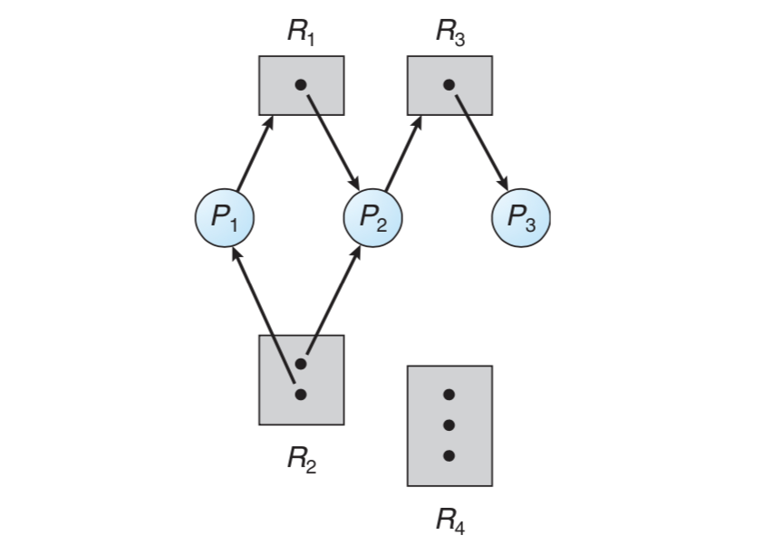
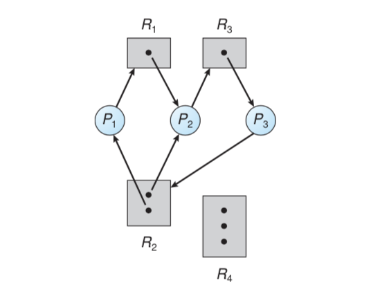
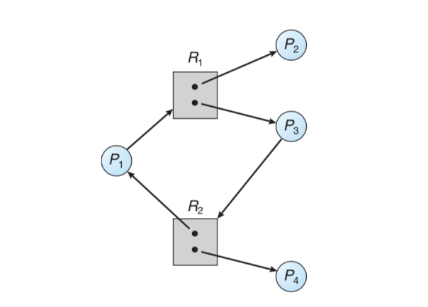
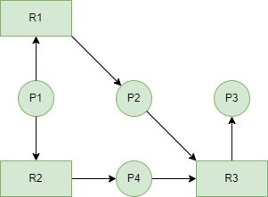
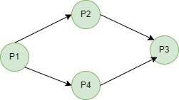
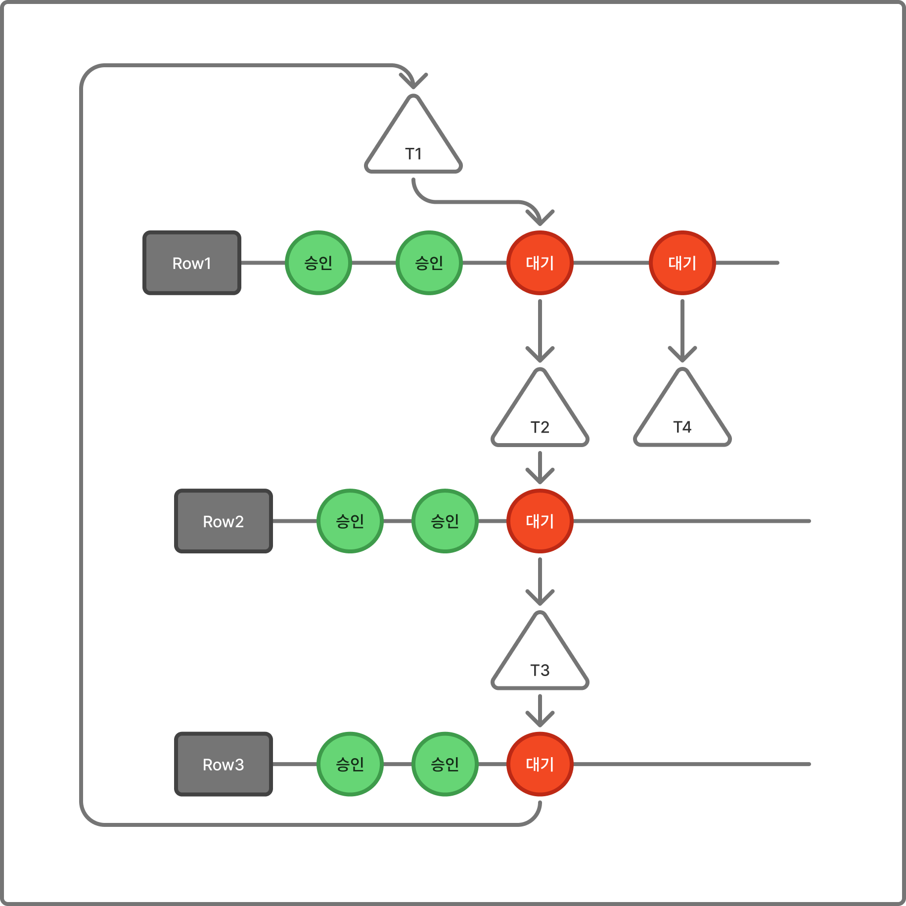
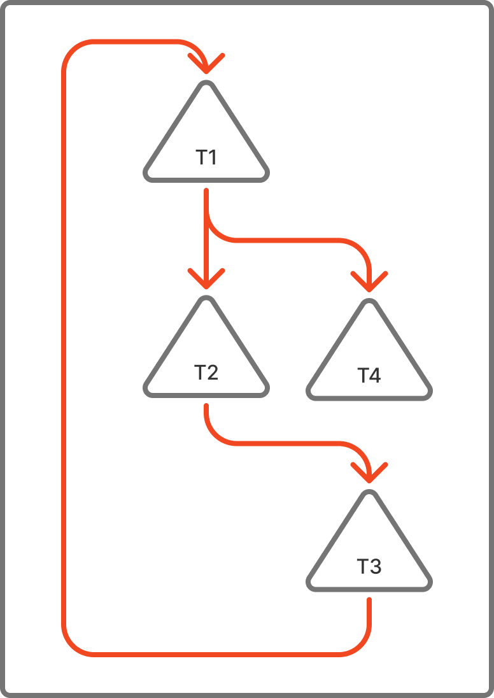
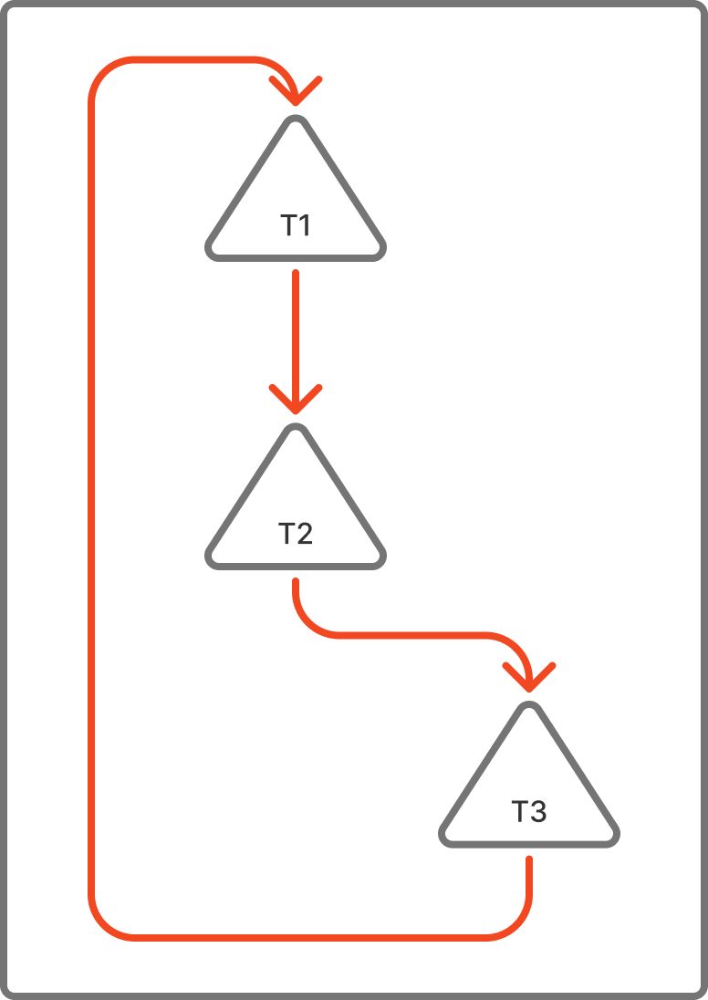

# 데드락과 MySQL에서의 데드락

발표초안

## 1. OS에서의 데드락

**데드락이란?**

프로세스들이 서로가 점유한 자원을 기다리면서 계속 대기상태에 있는 상황이다.

데드락의 4가지 발생 조건

아래 4가지 조건을 동시 만족할시 데드락이 발생하는 조건이 만족된다.

1. 상호 배제(Mutual exclusion)
2. 점유 대기(hold and wait)
3. 비선점(No preemption)
4. 순환 대기(circular wait)

데드락을 표현하는 방법 = **RAG**

**Resource Allocation Graph**



- P : 프로세스(동그라미)
- R : 리소스(직사각형)
- P → R : 프로세스가 자원을 요청한다
- R → P : 프로세스가 자원을 사용중이다.



- 사이클 발생 : P1 → R1 → P2 → R3 → P3 → R2 →P1

사이클이 존재하면 데드락 발생 가능성이 있다.

사이클이 있더라도 인스턴스가 여러개일경우 무조건 데드락이 발생하는건 아니다



그러나 인스턴스가 1개라면 사이클이 존재할때 데드락이다.

데드락을 해결하는 전략

1. 데드락을 절대 일어나지 않게 하는 경우
   1. 데드락 예방 → 네가지 조건중 하나를 일어나지 않도록 보장한다. 대신 성능이 감소된다.
   2. 데드락 회피

      현재 프로세스의 순서를 조합하여 프로세스의 자원 요청이 충족 가능한 상태인 경우를 safe state라 정의하고, Unsafe한 상태로 들어가지 않도록 보장하는것.

      단일 인스턴스 → RAG 활용

      여러 인스턴스 → Banker’s Algorithm 활용(최대 자원 요구량을 사전 선언, 안전 상태일때만 자원 할당)

2. 데드락을 탐지하고 복구하는경우
   1. 데드락 탐지

      단일 인스턴스 → Wait-for-graph 관리

      RAG의 변형 버전으로, 리소스에 대한 프로세스의 요청을 해당 리소스를 점유중인 프로세스에 대한 프로세스의 요청으로 변경.

      

      

      여러 인스턴스 → 뱅커랑 비슷한 탐지 알고리즘 적용

3. 데드락을 무시하는 경우

   데드락이 일어나지 않는다고 생각하고, 조치를 취하지 않는다.

   어차피 매우매우 드물게 발생하고, 조치 자체가 오버헤드이므로, 이를 사람이 감지한 뒤 직접 프로세스를 죽이는 등의 방법으로 대처.

   통상의 범용 운영체제가 선택하는 방법이다.

## 2. 백엔드에서 마주하는 데드락

결론부터 말하자면 DB에서 마주할 수 있다.

위에서 설명한 OS에서의 DeadLock은, **`프로세스`** 와 **`자원`** 사이에서 자원 점유/요청시 발생한다.

DB에서도 구조적으로 동일한 상황이 발생할 수 있지만, 주체와 대상이 바뀐다.

- 프로세스 → 트랜잭션
- 자원(CPU,파일 등) → Row(데이터)
- 자원 요청/점유 → 락 요청/점유

트랜잭션의 정의는, **"전부 성공하거나 전부 실패해야 하는 작업 단위"**다.

그렇기 때문에 트랜잭션은 데이터 일관성을 보장해야하며, 이를 위해 Row라는 자원에 락을 걸게 되며, 본질적으로 OS에서 프로세스가자원에 락을 거는 것과 동일한 구조이다!

그렇다면 DB에는 어떤 락이 존재하는지 잠깐 짧게 알아보고 넘어가자.

**Lock의 종류**

1. S락(Shared Lock = 공유 락)

   읽기용 락(Read), 여러 트랜잭션이 동시에 하나의 Row에 보유할 수 있다.

   읽기끼리는 충돌하지 않기 때문이다.

2. X락(Exclusive Lock = 배타 락)

   쓰기용 락(Write), 오직 하나의 Row에 하나의 트랜잭션만 보유할 수 있다. S락과도 공존이 불가능하다.(쓰는 도중에 읽기 불가능)

   즉, X락이 포함되는 순간부터 대기가 발생하고, 데드락의 가능성이 생긴다.

**Lock의 단위**

1. Row Lock

   특정 행에 대해 잠금을 진행한다.

2. Table Lock

   테이블 전체에 대해 잠금을 진행한다.

3. Gap Lock

   행 사위 범위에 잠금을 진행한다

   `WHERE id BETWEEN 10 AND 20` 이라는 구문에서, 실제로 id = 15 인 행이 없더라도 해당 범위에 락을 걸어서, 다른 트랜잭션이 그 사이에 새 행을 INSERT하지 못하게 한다.

   이는 팬텀 리드 방지가 목적이며 `REPEATABLE READ` 격리수준에서 동작한다.

그 외의 Next-Key Lock 등이 있으나 여기서는 자세히 다루지 않습니다,,,

락은 트랜잭션이 커밋 | 롤백 될때까지 유지되기 때문에, **트랜잭션 길이가 길면 길수록 락을 오래 잡고 있는다.**

그렇게 되면 다른 트랜잭션이 오래 기다려야 하고, 데드락 가능성도 높아지게 된다.

**DB에서 데드락이 발생하는 예시**

```
T1: Row A X락 점유 → Row B X락 요청 (대기)
T2: Row B X락 점유 → Row A X락 요청 (대기)
→ 사이클 발생 = 데드락
```

OS에서 RAG와 Wait-for-Graph에서 사이클을 데드락으로 탐지했던것처럼, DB또한 이러한 대기 관계 사이클을 데드락으로 판단한다!

MySQL에서 설명하는 ‘데이터 잠금’에 대해서는 아래 Mysql 개발 블로그에서 확인 가능합니다!

https://dev.mysql.com/blog-archive/innodb-data-locking-part-1-introduction/

## 3. MySQL InnoDB의 데드락 감지

그래서, DeadLock이 뭔지도 이해했고, DB에서도 OS에서 일어나는것과 유사한 구조로 트랜잭션에서 DeadLock이 발생할 수 있다는 것도 알았다.

MySQL에서 이를 탐지하는것은 무엇이냐면, InnoDB가 그 역할을 수행한다.

앞서 1장에서 말한 수많은 DeadLock 대처 방법 중, MySQL은 **감지 후 복구**를 사용한다. 그런데 Wait for Graph를 곁들인.

Banker 알고리즘의 경우, 트랜잭션 실행 전 최대 자원 요구량을 인지하고 있어야 하는데,,, DB 트랜잭션은 실행 전 몇개의 자원에 락을 걸지 예측이 불가능하다고 한다.

쿼리가 실제로 실행되는 시점의 데이터 상태, 인덱스 활용 여부, 격리 수준(Isolation Level) 등에 따라 락의 갯수가 가변적이기 때문이라고 합니다…

### 3-1. 8.0.18버전 이전

8.0.18버전 이전에는 어떻게 DeadLock을 감지했을까??



이는 해당 트랜잭션의 스레드가 ‘**대기 관계가 추가되는 시점**에’ 직접 Wait-for-graph를 깊이 우선 탐색으로 확인합니다.

```
T1이 Row B에 X락 요청 → 이미 T2가 점유 중 → T1 대기 상태 진입
→ T1의 스레드가 직접 lock_sys mutex 획득
→ T1이 직접 DFS 탐색 시작
   (T2가 어디서 대기 중인지 → T3가 어디서 대기 중인지 → ... → T1이 나오면 사이클!)
→ 사이클 감지 = 데드락 판정
→ lock_sys mutex 해제
→ victim 선택 후 롤백(롤백할 트랜잭션을 조건에 맞게 선택)
```

여기서, `lock_sys mutex` 란, DB 내부에서 어떤 트랜잭션이 어떤 Row를 점유하고 있는지, 누가 대기하고 있는지 등을 저장하는 자료구조에 대한 전역 잠금입니다.

즉, T1이 락을 해결하기 위해 `lock_sys mutex` 에 접근하고, 이 정보들이 전역 공유 가능한 데이터이기 때문에, 이 데이터를 점유하고 있는 동안 다른 T5, T6 등이 락을 탐지하려고 해도 대기 상황이 되는 것입니다.

결국 데드락을 ‘탐지’ 하기 위한 오버헤드가 오히려 전체 처리량을 떨어뜨리는 아이러니한 상황이 발생하게 됩니다.

물론 이를 방지하기 위해 대기 트랜잭션이나 락이 매우 많아지는 경우에는 탐색을 포기하고 탐색 트랜잭션을 그냥 롤백시켜 버리긴 합니다.

### 3-2. 8.0.18버전 이후

그래서 이전 버전까지의 문제는 데드락을 탐지하는 동안, 전체 락 시스템이 멈춰버린다는 것이였습니다.

MySQL 개발팀은 이를 해결하기 위해서, 3가지 관찰을 기반으로 알고리즘을 재설계했다고 합니다.

1. 그래프 단순화 가능

   

   혹시 1장에서 Resource Allocation Graph를 Wait-For-Graph로 줄였던 과정이 기억나시나요?

   Process, Resource 정점이 있던것을 Process만 갖도록 줄였습니다. 왜냐면? 어차피 자원과 그 할당 간선이 의미하는건 ‘특정 프로세스가 사용중이다’ 는 것이므로.

   요청하는 프로세스가 해당 프로세스로 바로 간선을 그렸던 것입니다.

   이와 비슷합니다.

   MySQL이 관리하던 Wait-for-graph도 Transaction과 Row로 구성되어있는데, 이를 Transaction만 갖도록 줄인 것입니다.

2. 거기서 그래프를 더 단순화 가능

   

   거기서 더 단순화 할 수 있다고 합니다.

   어떻게?

   하나의 트랜잭션이 다른 여러 트랜잭션에 대한 대기 엣지를 가지고 있다고 한다면, 이를 **가장 오래된 대기 엣지 하나만 남겨도 사이클을 반드시 감지 가능하다**는것이 수학적으로 증명되었다고 합니다.

   증명까지 알아보기에는 여백이 부족해서 적지 않겠습니다…

   결국, ‘트랜잭션 하나에 엣지 하나인’ 아주 단순한 그래프로 만들어 탐색을 빠르게, 거의 선형 시간 내에 가능하게 합니다.

3. 전체 세상을 멈출 필요가 없다

   데드락 사이클에 포함된모든 트랜잭션은 대기 상태입니다.

   대기중인 트랜잭션은 ‘락을 새로 잡거나 해제’하지 않습니다.

   그렇기 때문에 ‘현재 대기 중인 트랜잭션으로 인해 그래프는 변하지 않습니다’.

   따라서, 현재 대기중인 트랜잭션 목록을, 잠금을 통해 스레드가 잡고 탐색하는게 아니라, 스냅샷으로 복사하여 그 복사본으로 탐색해도 실제 그래프에서 사이클이 존재할때 복사본에서도 반드시 감지된다는 보장을 얻게 되었다고 합니다!

즉, 아래 흐름을 따르도록 변경되었습니다.

```
1. 트랜잭션이 락 대기 상태 → 그냥 대기 큐에 들어감
2. 전용 백그라운드 스레드(deadlock checker thread)가
   대기 중인 트랜잭션 목록을 스냅샷으로 복사
   (이 순간만 아주 짧게 lock_sys mutex 획득 후 즉시 해제)
3. 복사본으로 사이클 탐색
   (실제 락 시스템과 완전히 독립적으로 동작)
4. 사이클 발견 시 victim 선택 후 롤백
```

이를 통해 `lock_sys mutex` 를 잡는 시간이 극도로 짧아졌고, 트랜잭션 스레드들은 탐색과 무관하게 계속 락을 잡고 해제 가능하게 되었습니다.

**victim은 어떻게 선택되나요?…**

보통 가장 변경 데이터가 적은 트랜잭션(undo log 크기가 작은 T)을 선택해서 롤백시킵니다.(비용 최소화 목적)

그래서 해당 트랜잭션은 에러를 반환받고, 애플리케이션 수준에서 해당 트랜잭션을 재시도한다고 합니다.

그래서 기존까지는, Deadlock detection을 위한 오버헤드가 너무 컸기에, MySQL에서 `innodb_deadlock_detect` 옵션을 OFF로 설정하는것을 허용했으나, 해당 버전 이후부터는 기본값 유지를 권장하고 있다고 합니다.
