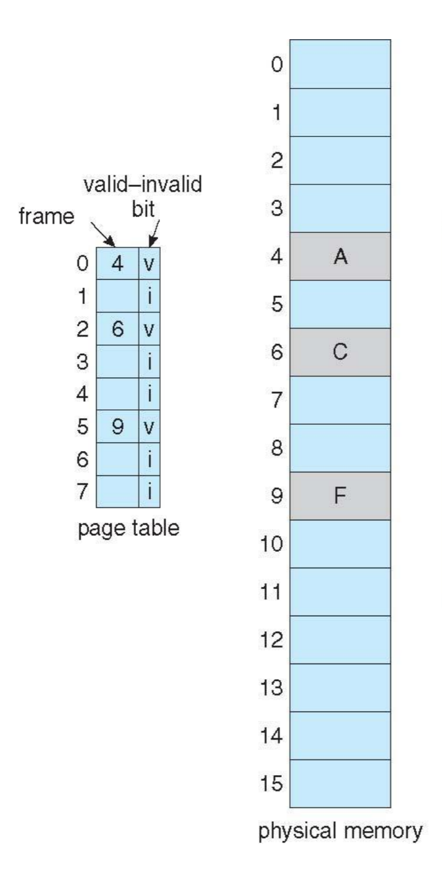
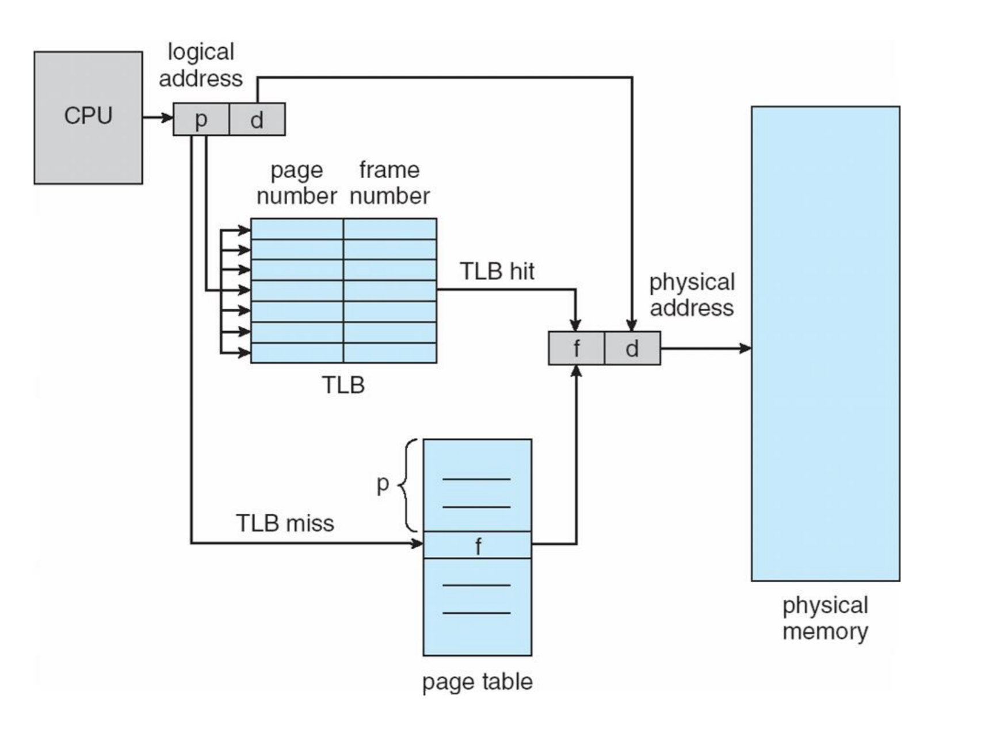
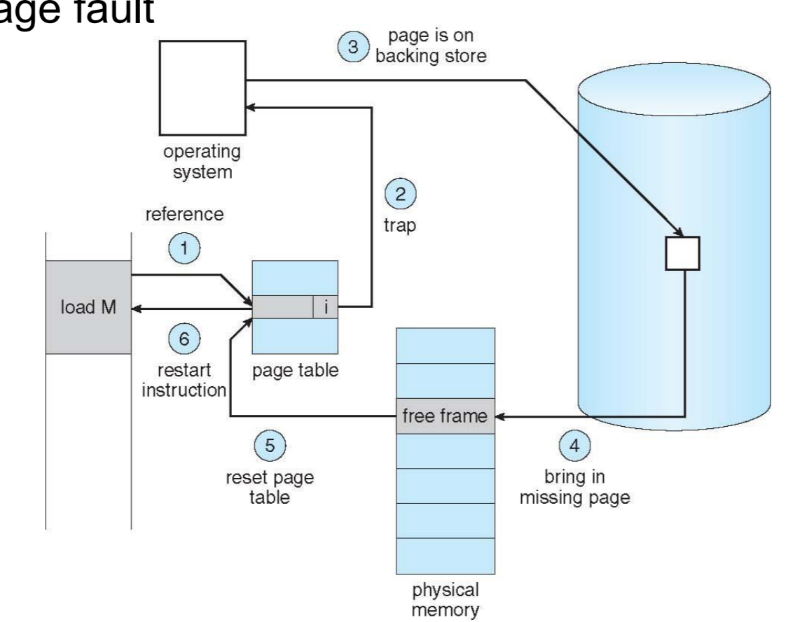
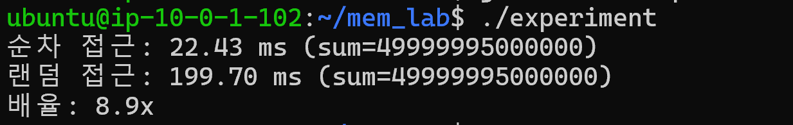
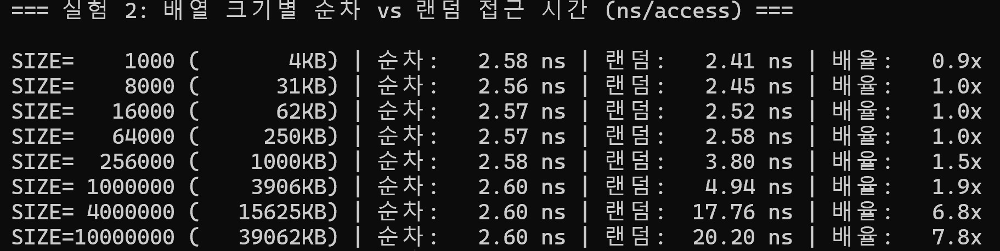

# 메모리 지역성 실험

## 1. 배경 지식

### 1.1 페이지와 프레임

OS는 논리 메모리를 고정 크기(보통 4KB)로 나누어 관리하는데, 이 단위를 **페이지(Page)** 라고 합니다.

물리 메모리도 같은 크기로 나누며, 이 단위를 **프레임(Frame)**이라고 합니다.

**페이지 테이블**이 이 둘의 매핑을 관리합니다. 즉, "논리 페이지 3번 → 물리 프레임 7번"과 같은 정보를 저장하는 데이터 구조이며, 프로세스마다 하나씩 존재합니다.



### 1.2 프로세스가 데이터를 읽는 과정

프로세스가 어떠한 데이터에 접근하려면, CPU는 **가상 주소**를 통해서 먼저 접근합니다.

이 가상 주소는 **MMU**(Memory Management Unit)라는 하드웨어를 통해 실제 물리 주소로 변환됩니다.

MMU 내부에는 **TLB**(Translation Lookaside Buffer)라는 소형 캐시가 있어, 최근 사용된 페이지 번호 → 프레임 번호 매핑을 저장해두고 빠르게 변환합니다.

(TLB의 자세한 동작은 1.5에서…..)

아무튼, TLB에서 프레임 번호 매핑을 실패했을 경우, 앞서 말한 페이지 테이블에 저장된 프레임의 물리 주소를 획득하려고 갑니다.



```
프로세스: 주소 0x7FFF00에 있는 데이터 읽기 요청

MMU: 페이지 테이블의 valid-invalid 비트(v,i으로 구성) 확인
    ↓
  v = (valid) = 유효하구나 → 물리 프레임 주소 획득 → 캐시 계층 탐색
  i = (invalid) = 유효하지 않구나 → ⚠️ Page Fault 발생!
```

이 흐름은 크게 두 갈래로 나뉘어집니다.

**HIT 시(valid bit = v)에 → 캐시 계층 탐색**

물리 주소를 얻은 뒤, CPU는 바로 메인 메모리로 가지 않고 가장 빠른 캐시부터 탐색합니다.

```
L1 캐시 -> L2 캐시 -> L3 캐시 -> 메인 메모리 RAM
```

**페이지 폴트 경로 → 디스크 접근**

페이지 테이블의 valid 비트가 `i`라면, 해당 페이지는 아직 물리 메모리에 올라와 있지 않습니다. 이때 **페이지 폴트 트랩**이 발생합니다.

페이지 폴트의 비용은 약 8ms로, 일반 메모리 접근(200ns) 대비 약 4만 배 느립니다.

```
1. MMU가 트랩(인터럽트) 발생
2. OS가 디스크(Swap 영역)에서 해당 4KB 페이지를 찾음
3. 빈 프레임에 페이지를 적재 (없으면 기존 페이지를 교체)
4. 페이지 테이블의 valid 비트를 v로 갱신
5. 명령어 재시작
```



### 1.3 캐시라인과 페이지

**캐시라인 (Cache Line) = 64바이트**

CPU가 캐시에 데이터를 올리는 최소 단위입니다.

예를 들어, `arr[0]`을 읽으면 `arr[0]`만 가져오는 게 아니라, 64바이트 블록 전체를 캐시에 올린다.

```
arr[0]을 읽음
→ arr[0]이 포함된 64바이트 블록을 통째로 캐시에 올림
→ int = 4바이트이므로, 64 / 4 = 16개가 한 번에 올라옴
→ arr[1] ~ arr[15]는 이미 캐시에 있음 → 캐시 히트가 됨.
```

**페이지 (Page) = 4KB**

OS가 가상 메모리를 관리하는 최소 단위입니다.

프로그램이 처음 접근하는 메모리 영역은 물리 메모리에 매핑되어 있지 않을 수 있다. 이때 페이지 폴트가 발생하고, OS가 4KB 단위로 물리 메모리에 매핑해줍니다.

```
arr[0]을 읽음
→ 이 주소가 속한 4KB 페이지가 물리 메모리에 없으면 → 페이지 폴트
→ OS가 4KB 페이지를 물리 메모리에 할당
→ 4096 / 4 = 1024개의 int가 한 번에 매핑됨
```

만약 물리 메모리에 프레임이 없을 때는, OS가 페이지 교체를 시도합니다.

이때 OS가 페이지 교체 알고리즘을 바탕으로 victim을 선정하고, 이때 dirty 비트(=변경되었는지) 비트가 1이라면, 페이지를 디스크에 기록하고, 아니라면 바로 덮어씁니다.

### 1.4 지역성 (Locality)

CPU가 메모리에 접근할 때, 균일하게 전체를 접근하는 것이 아니라 최근 사용한 데이터나 그 주변 데이터를 집중적으로 다시 참조하는 경향이 있음을 말합니다.

OS의 Demand Paging이 작동하는 이유도, CPU 캐시가 효율적인 이유도, 모두 지역성 때문입니다.

> **Demand Paging(요구 페이징)**: 프로그램 실행 시, 전체 프로세스를 메모리에 올리지 않고, CPU가 필요로 하는 페이지들만 그때그때 물리 메모리로 적재하는 기법.

**Spatial Locality (공간 지역성)**

"이 주소를 읽었으면 근처 주소도 곧 읽을 것이다."

최근에 참조된 데이터 주변의 데이터가 곧 사용될 가능성이 높은 경향.

**Temporal Locality (시간 지역성)**

"이 데이터를 읽었으면 곧 다시 읽을 것이다."

최근에 참조된 데이터가 곧 다시 사용될 가능성이 높은 경향.

### 1.5 TLB

1.2에서 MMU 내부에 TLB가 있다고 언급했습니다.

페이지 테이블은 메인 메모리에 있으므로, TLB 미스가 발생하면 **데이터를 읽기 위해 메모리를 먼저 한 번 읽어야 하는** 오버헤드가 생깁니다.

TLB의 엔트리 수는 보통 64~1024개로 매우 적습니다. 하나의 엔트리가 4KB 페이지를 커버하므로, TLB가 커버하는 총 메모리 범위는 다음과 같습니다.

<aside>
💡

TLB 커버리지 = 엔트리 수 × 페이지 크기 = 1024 × 4KB = 약 4MB

</aside>

순차 접근은 같은 페이지 내 1024개 int를 연속으로 읽는 동안 TLB 히트가 유지됩니다. 반면 랜덤 접근은 매번 다른 페이지로 점프할 수 있어, 배열이 TLB 커버리지를 넘으면 TLB 미스가 빈번해집니다.

### 1.6 순차 접근 vs 랜덤 접근

지금까지 다룬 캐시라인, 지역성, TLB를 종합해서, 순차 접근과 랜덤 접근의 성능 차이가 왜 발생하는지 설명하려고 합니다.

**순차 접근이 유리한 3가지 이유**

1. **캐시라인 활용**

   64바이트를 한 번에 올리므로 int 16개 중 15개는 공짜로 캐시 히트가 됩니다.

2. **TLB 히트**

   같은 4KB 페이지 안에서 1024개 int를 연속으로 소비하므로 TLB 미스가 최소화됩니다.

3. **하드웨어 프리페처**

   새로 언급하는 개념이긴 한데… 공부를 하기위해 찾다보니 이런것도 있다고 합니다

   CPU 내부에 메모리 접근 패턴을 감지하여 다음 캐시라인을 미리 적재하는 하드웨어가 있습니다. 순차 접근은 규칙적 패턴이므로 프리페처가 정확히 예측하여 캐시 미스를 사전에 방지합니다.

**랜덤 접근이 불리한 이유는,,,**

캐시라인에 올린 나머지 15개 원소를 쓰지 못한 채 다른 캐시라인을 요청하고, 매번 다른 페이지로 점프하여 TLB 미스가 빈번하며, 접근 패턴이 없어 프리페처가 무력화됩니다.

## 2. 실습해보자

실습 환경

정확한 측정을 위해 JVM 같은 중간 계층 없이 **C 언어**를 사용하고, Linux의 `perf stat`으로 하드웨어 카운터를 직접 읽고자 합니다.

AWS EC2 인스턴스(Ubuntu)에서 실행합니다.

실행시 옵션은 아래와 같습니다.

```bash
gcc -O0 -o experiment experiment.c   # 컴파일러 최적화 끄기
sudo perf stat -e page-faults ./experiment
```

---

### 실험 1: 순차 접근 vs 랜덤 접근

배열 크기 1,000만 개(약 40MB)로 순차/랜덤 접근의 성능 차이를 측정

```c
#define SIZE 10000000
int arr[SIZE];

// 순차 접근
for (int i = 0; i < SIZE; i++)
    sum += arr[i];

// 랜덤 접근 (미리 셔플된 인덱스 배열)
for (int i = 0; i < SIZE; i++)
    sum += arr[indices[i]];
```

두 결과의 시간 비교



---

### 실험 2: 배열 크기별 성능 변화

배열 크기를 점진적으로 늘려가며 랜덤 접근의 접근당 소요 시간을 측정합니다.

```
1000,       // ~4KB     L1
8000,       // ~32KB    L1 경계
16000,      // ~64KB    L1 초과
64000,      // ~256KB   L2
256000,     // ~1MB     L2/L3 경계
1000000,    // ~4MB     L3
4000000,    // ~16MB    L3 경계
10000000,   // ~40MB    RAM
```

두 결과의 시간 비교



순차 접근은 하드웨어 프리페처 덕분에 배열 크기와 무관하게 거의 일정하다!...

랜덤 접근은 **캐시 경계를 넘을 때마다 계단식으로 느려진다.**

만약 배열이 극단적으로 커지면 RAM도 부족해져 **페이지 폴트**가 지속적으로 발생하여 성능이 크게 하락합니다.
